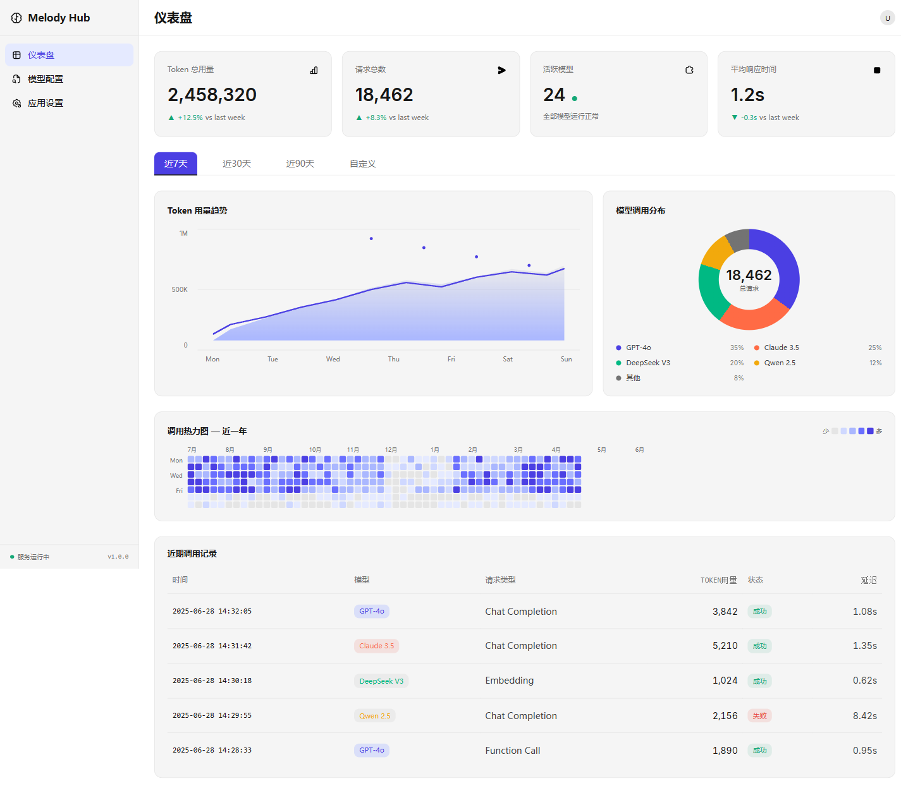
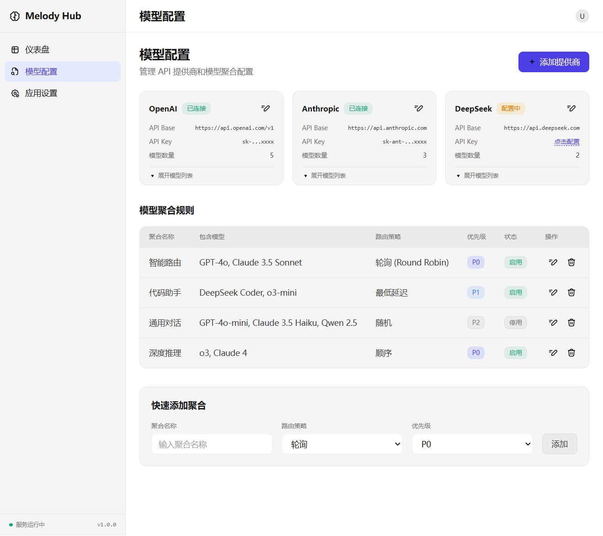
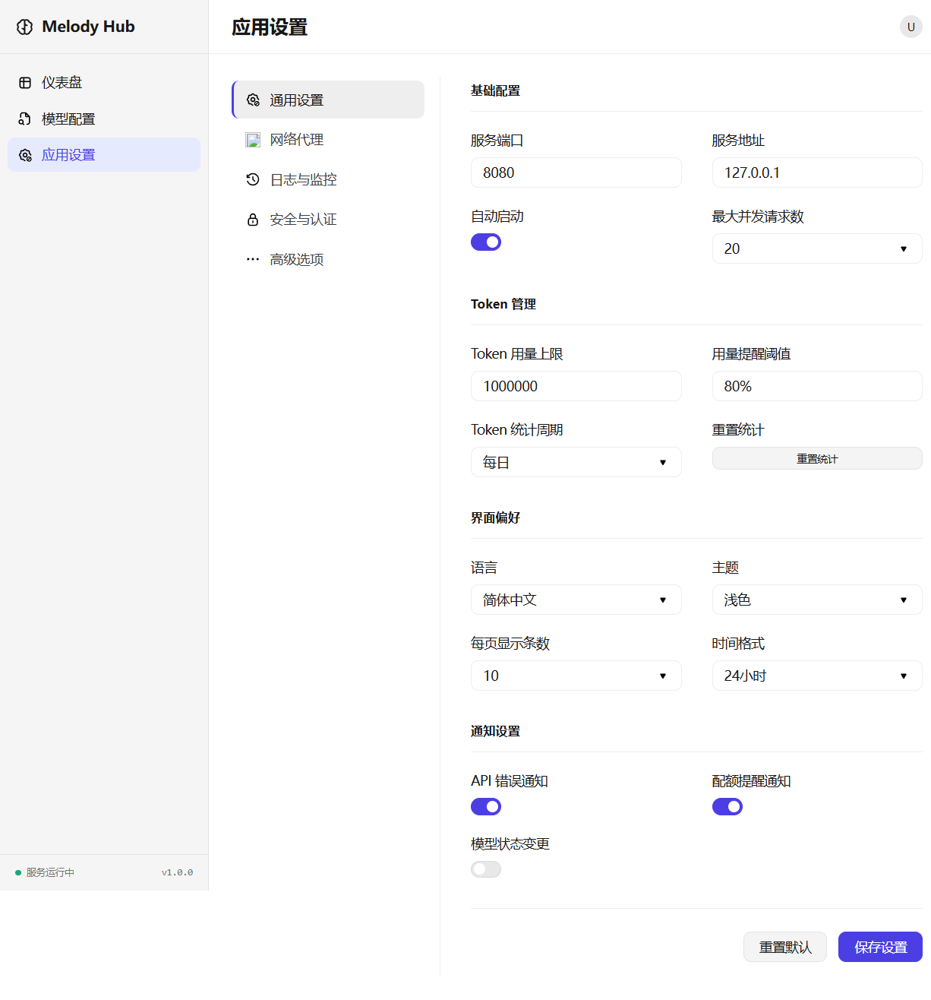
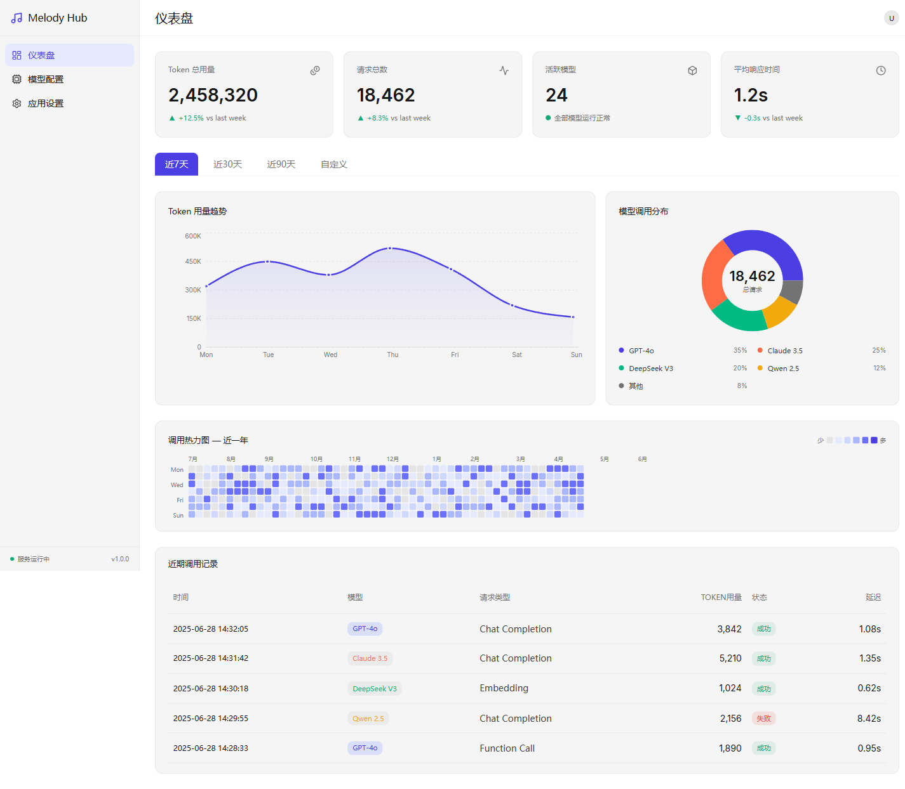
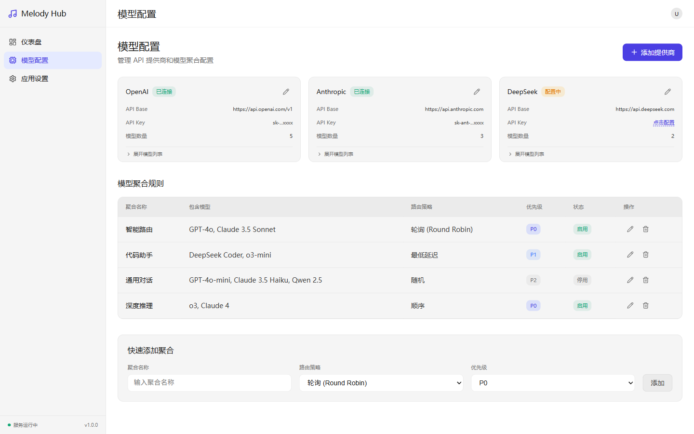
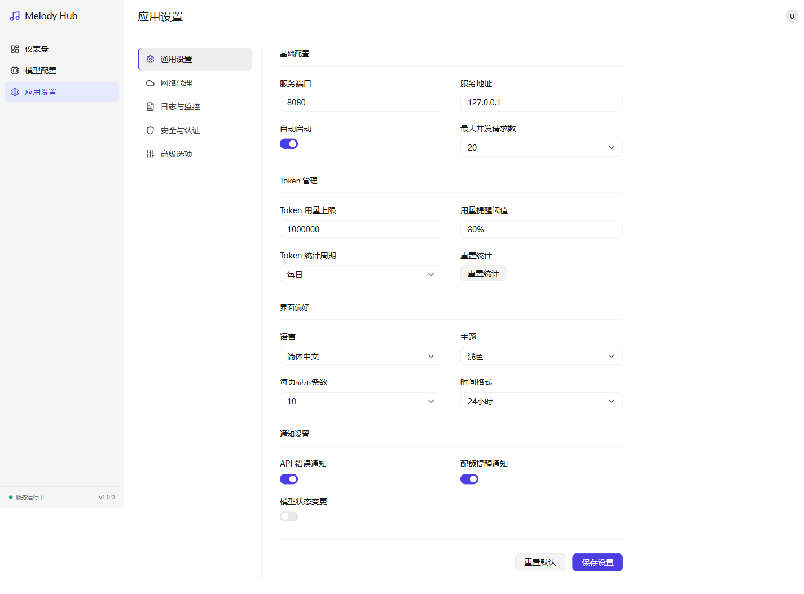

<h1 align="center">Melody Hub</h1>

<p align="center">
  
  
  
  
  
</p>

<p align="center">
  <em>一个本地优先的 LLM API 聚合代理桌面应用，统一管理多家模型提供商、路由策略和用量监控。</em>
</p>


## 项目简介

Melody Hub 是一个基于 Tauri 的本地桌面应用，用来把 OpenAI、Anthropic、DeepSeek 以及 OpenAI-compatible 服务聚合到统一入口。它在本机启动一个 OpenAI 兼容代理服务，让客户端只需要接入一个地址，就可以按配置路由到不同模型提供商，同时在仪表盘里查看请求、Token、延迟和模型使用情况。

**核心特性：**

- **多提供商管理** - 管理 OpenAI、Anthropic、DeepSeek 与自定义 OpenAI-compatible API。
- **聚合路由策略** - 支持轮询、最低延迟、随机、顺序等模型选择策略。
- **本地代理服务** - 提供 `/v1/chat/completions` OpenAI 兼容接口，并支持 SSE 流式响应。
- **安全本地存储** - API Key 使用 AES-256-GCM 加密保存，认证令牌首次启动自动生成。
- **用量监控面板** - 展示 Token 用量、请求数、活跃模型、平均响应时间、趋势和热力图。
- **请求记录与导出** - JSONL 滚动日志持久化，可导出请求记录并打开日志目录。
- **双语界面** - 内置简体中文和 English 界面。


## 示例 / 截图

| 仪表盘 | 模型配置 | 设置 |
|---|---|---|
|  |  |  |

| 构建仪表盘 | 构建模型配置 | 构建设置 |
|---|---|---|
|  |  |  |


## 安装指南

### 环境要求

- Node.js `^20.19.0 || >=22.12.0`
- pnpm `>= 9`
- Rust stable `>= 1.77`，建议通过 [rustup](https://rustup.rs/) 安装
- Windows 10+，系统需具备 WebView2 Runtime
- macOS / Linux 理论可运行；Linux 需要 Tauri 依赖，如 `webkit2gtk-4.1`、`libappindicator` 等

### 从源码运行

```bash
git clone https://github.com/Lhy723/MelodyHub.git
cd MelodyHub

pnpm install
pnpm tauri dev
```

仅运行前端调试服务器：

```bash
pnpm dev
```

### 构建安装包

```bash
pnpm tauri build
```

构建产物默认位于：

```text
src-tauri/target/release/bundle/
```

Windows 会生成 MSI / NSIS 等安装包，具体目录通常为：

```text
src-tauri/target/release/bundle/msi/
src-tauri/target/release/bundle/nsis/
```


## 使用文档

### 快速上手

1. 启动 Melody Hub。
2. 在「模型配置」中添加提供商，填写 Base URL、API Key 和模型列表。
3. 创建聚合规则，选择路由策略和参与路由的模型。
4. 在「设置」中确认本地代理端口、认证令牌、并发数和超时配置。
5. 在其它客户端中把 API Base URL 指向 Melody Hub 本地代理。

默认代理地址：

```text
http://127.0.0.1:8080
```

### OpenAI 兼容调用

```bash
curl http://127.0.0.1:8080/v1/chat/completions \
  -H "Authorization: Bearer <your-token>" \
  -H "Content-Type: application/json" \
  -d '{
    "model": "gpt-4o",
    "messages": [
      { "role": "user", "content": "Hello from Melody Hub" }
    ]
  }'
```

流式响应：

```bash
curl http://127.0.0.1:8080/v1/chat/completions \
  -H "Authorization: Bearer <your-token>" \
  -H "Content-Type: application/json" \
  -d '{
    "model": "gpt-4o",
    "messages": [
      { "role": "user", "content": "Stream this response" }
    ],
    "stream": true
  }'
```

健康检查：

```bash
curl http://127.0.0.1:8080/health
```

### 核心概念

| 概念 | 说明 |
|------|------|
| Provider | 一个上游模型服务，例如 OpenAI、Anthropic、DeepSeek 或自定义兼容服务。 |
| Model | Provider 下的具体模型配置。 |
| Aggregation | 聚合规则，把多个模型组合成一个可路由的逻辑模型。 |
| Routing Strategy | 聚合规则的选择策略，包括轮询、最低延迟、随机、顺序。 |
| Proxy Auth Token | Melody Hub 本地代理的 Bearer Token，用于防止未授权访问。 |

### 主要配置

<details>
<summary><b>配置项一览</b></summary>

| 名称 | 默认值 | 说明 |
|------|--------|------|
| `host` | `127.0.0.1` | 本地代理绑定地址。 |
| `port` | `8080` | 本地代理监听端口。 |
| `autoStart` | `true` | 启动应用后是否自动启动代理服务。 |
| `maxConcurrency` | `20` | 最大并发请求数。 |
| `timeoutMs` | `30000` | 上游请求超时时间。 |
| `authToken` | 首次启动生成 | 访问代理接口需要使用的 Bearer Token。 |
| `proxyEnabled` | `false` | 是否为上游请求启用网络代理。 |
| `proxyPort` | `7890` | 上游网络代理端口。 |

</details>


## 本地开发

```bash
# 安装依赖
pnpm install

# 启动 Tauri 桌面开发模式
pnpm tauri dev

# 仅启动前端
pnpm dev

# 前端类型检查和构建
pnpm typecheck
pnpm build

# 代码检查和格式化
pnpm lint
pnpm format:check

# 前端单元测试
pnpm test

# 端到端测试
pnpm test:e2e

# Rust 后端检查和测试
cd src-tauri
cargo check
cargo test
```

### 目录结构

```text
MelodyHub/
├── src/                  # React 前端源码
│   ├── components/        # Shell 与通用 UI 组件
│   ├── i18n/              # 中英文文案
│   ├── pages/             # Dashboard / ModelConfig / Settings
│   ├── store/             # Zustand 状态管理
│   └── types/             # 前端类型定义
├── src-tauri/             # Tauri + Rust 后端
│   ├── src/commands/      # Tauri command
│   ├── src/proxy/         # 本地代理、路由、指标和适配器
│   └── tauri.conf.json    # Tauri 应用配置
├── e2e/                   # Playwright 测试
├── public/                # 静态资源
├── CHANGELOG.md           # 版本变更记录
└── package.json           # 前端脚本和依赖
```


## 数据与安全

- 本地代理默认绑定 `127.0.0.1`，不会暴露到局域网。
- `/health` 不需要认证，其它代理接口需要 `Authorization: Bearer <token>`。
- API Key 会加密写入 Tauri app data 目录。
- 请求记录以 JSONL 形式滚动持久化，导出前会先 flush 内存记录。
- 上游错误响应会做截断，避免过长错误信息直接进入界面。

应用数据目录：

| 平台 | 路径 |
|------|------|
| Windows | `%APPDATA%/com.melody-hub.app/melody-hub/` |
| macOS | `~/Library/Application Support/com.melody-hub.app/melody-hub/` |
| Linux | `~/.local/share/com.melody-hub.app/melody-hub/` |


## 发布与首次远程推送

首次推送到 GitHub 前建议检查：

- 确认 `pnpm-lock.yaml`、`src-tauri/Cargo.lock`、截图和图标资源都已纳入版本控制。
- 确认 `.gitignore` 已排除 `node_modules/`、`dist/`、`src-tauri/target/` 等构建产物。
- 如需正式开源，请补充 `LICENSE` 文件；当前 README 按既有文档标记为 MIT。
- 如需启用自动更新，请替换 `src-tauri/tauri.conf.json` 中的 updater `pubkey`。
- Windows 正式分发前建议配置代码签名，减少 SmartScreen 拦截。

推送示例：

```bash
git add .
git commit -m "chore: prepare initial release"
git push -u origin main
```


## Changelog

完整版本记录请查看 [CHANGELOG.md](./CHANGELOG.md)。


## 许可证

MIT。当前仓库尚未包含 `LICENSE` 文件，公开发布前建议补充标准 MIT License 文本。


## Star 趋势

[](https://star-history.com/#Lhy723/MelodyHub&Date)


<p align="center">
  <sub>Built with Tauri, React and Rust by <a href="https://github.com/Lhy723">Lhy723</a></sub>
</p>
