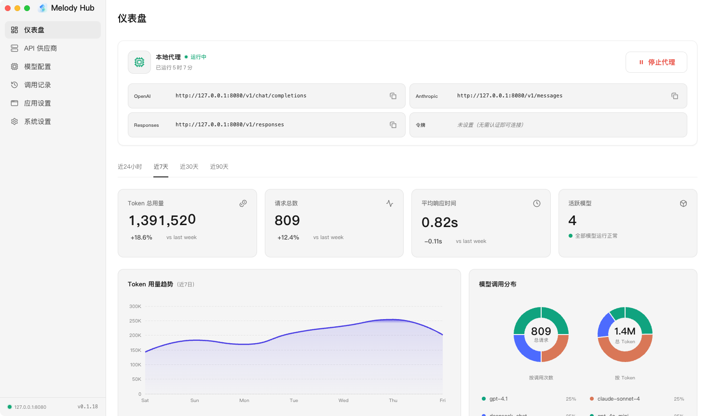
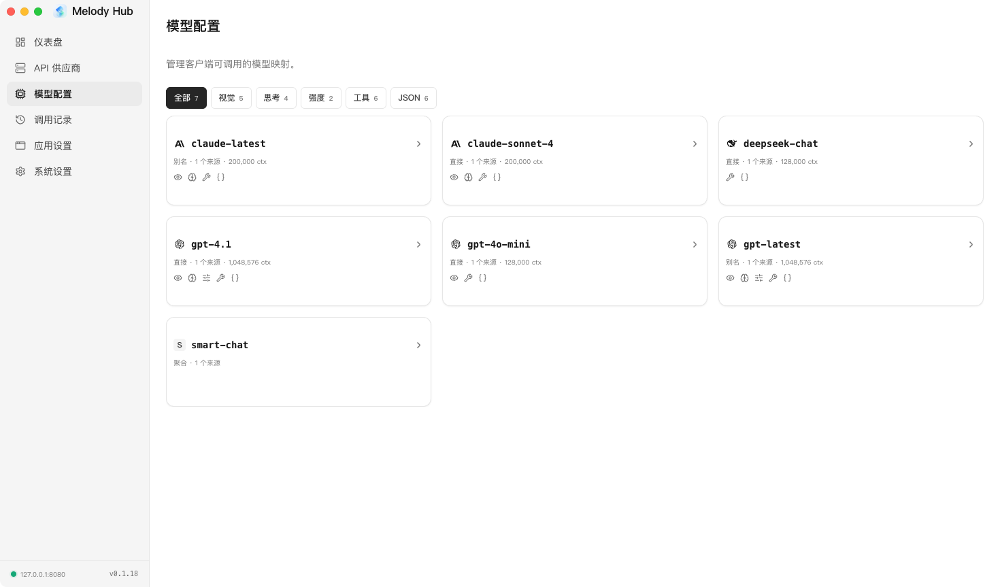
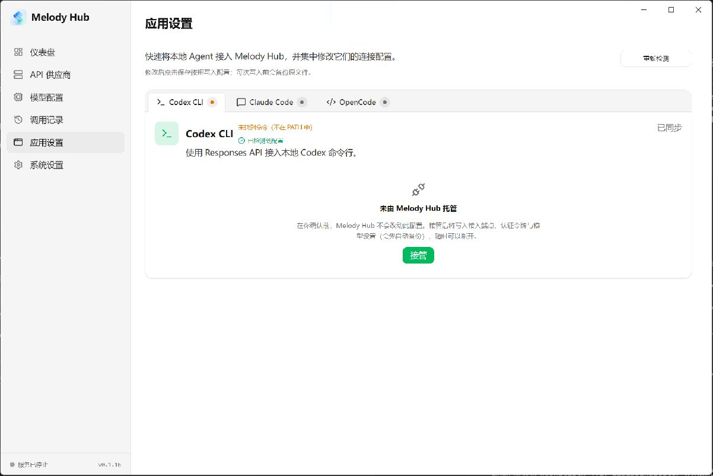

<p align="center">
  
</p>

<h1 align="center">Melody Hub</h1>

<p align="center">
  
  
  
  
  
</p>

<p align="center">
  <em>本地优先的 LLM API 网关与桌面控制台。</em>
</p>


## 项目简介

Melody Hub 基于 Tauri、React 和 Rust 构建，用一个本地地址统一接入 OpenAI、Anthropic、DeepSeek 及其他 OpenAI-compatible 服务。你可以在桌面界面中管理提供商与模型、组合路由规则，并查看请求量、Token 用量、延迟和上游健康状态。

**核心特性：**

- **三协议双向转换** - OpenAI Chat Completions、Anthropic Messages 与 OpenAI Responses 任一入口均可访问另外两种协议的上游，并支持 SSE 流式转换。
- **多提供商与模型管理** - 内置常用服务预设，也可连接自定义 OpenAI-compatible API；支持模型别名、能力参数和详情查看。
- **聚合路由与故障转移** - 支持轮询、最低延迟、随机和顺序策略，并根据能力、并发与上游健康状态选择可用模型。
- **安全的本地配置** - API Key 使用 AES-256-GCM 加密保存；首次启动自动生成代理认证令牌。
- **用量与健康监控** - 展示 Token、请求数、响应时间、趋势、热力图、近期请求和提供商健康状态。
- **可调代理策略** - 支持速率限制、超时、重试、并发数、IP 白名单、CORS 与上游网络代理。
- **桌面体验** - 设置自动保存，支持中英文、主题与强调色、系统托盘和开机启动。
- **本地日志** - 请求记录以 JSONL 滚动持久化，可导出记录并直接打开日志目录。


## 界面预览

| 仪表盘 | 模型配置 | 设置 |
|---|---|---|
|  |  |  |


## 安装指南

从 [GitHub Releases](https://github.com/Lhy723/MelodyHub/releases/latest) 下载对应平台的安装包：

| 平台 | 文件 |
|------|------|
| macOS (Apple Silicon) | `MelodyHub_*_aarch64.dmg` |
| macOS (Intel) | `MelodyHub_*_x64.dmg` |
| Windows | `MelodyHub_*_x64-setup.exe` |
| Linux | `melody-hub_*_amd64.deb` 或 `*.AppImage` |

macOS 首次打开时如果提示"无法验证开发者"，请在系统设置 → 隐私与安全性中点击"仍要打开"。

### 环境要求

- Windows 10+，系统需具备 WebView2 Runtime
- macOS 10.15+
- Linux 需安装 `webkit2gtk-4.1`、`libappindicator` 等系统依赖

从源码构建的环境要求见[开发指南](#开发指南)。


## 使用文档

### 快速上手

1. 启动 Melody Hub。
2. 在「API 供应商」中配置提供商，填写 Base URL、API Key 和模型列表。
3. 在「模型配置」中查看和管理聚合规则，将多个模型组合为可路由逻辑模型。
4. 在「应用设置」中确认本地代理端口、认证令牌、并发数和超时配置。
5. 在其他客户端中把 API Base URL 指向 Melody Hub 本地代理，并使用设置页中的认证令牌。

默认代理地址：

```text
http://127.0.0.1:8080
```

### 支持的本地端点

| 方法 | 路径 | 用途 |
|------|------|------|
| `GET` | `/health` | 本地代理健康检查，无需认证。 |
| `GET` | `/v1/models` | 返回当前可路由的模型。 |
| `GET` | `/v1/capabilities` | 返回协议矩阵、模型能力、目标配置与当前可用性。 |
| `POST` | `/v1/chat/completions` | OpenAI Chat Completions 兼容接口。 |
| `POST` | `/v1/responses` | OpenAI Responses API 兼容接口。 |
| `POST` | `/v1/messages` | Anthropic Messages API 兼容接口。 |
| `POST` | `/v1/messages/count_tokens` | 返回输入 Token 估算值（`estimated: true`）。 |
| `POST` | `/v1/responses/input_tokens` | 返回输入 Token 估算值（`estimated: true`）。 |
| `*` | `/v1/images/*` | 图像 API 透传。 |
| `*` | `/v1/audio/*` | 语音 API 透传。 |
| `*` | `/v1/files/*` | 文件 API 透传。 |
| `*` | `/v1/batches/*` | Batch API 透传。 |

图像、语音、文件和 Batch 等无统一模型字段的请求，可通过
`x-melody-provider-id` 指定上游；仅配置一个提供商时会自动选择。
这些端点不包含 Embeddings。

### 转换与降级规则

- 文本、流式文本、工具定义/选择/调用结果、JSON Schema 结构化输出、图像/文件输入和推理参数通过内部统一表示转换。
- 工具调用和结构化输出不能无损转换时返回
  `capability_conversion_error`（请求侧为 HTTP `422`），不会静默删除字段。
- 其他协议差异按可表示能力转换；响应会带
  `x-melody-upstream-protocol`，显式目标还会带 `x-melody-target-id`。
- 聚合目标可分别设置上游协议、模型名、优先级、权重、超时与重试。
  老版本仅含 `models` 的聚合配置继续按原逻辑工作。

### 核心概念

| 概念 | 说明 |
|------|------|
| Provider | 一个上游模型服务，例如 OpenAI、Anthropic、DeepSeek 或自定义兼容服务。 |
| Model | Provider 下的具体模型配置。 |
| Aggregation | 聚合规则，把多个模型组合成一个可路由的逻辑模型。 |
| Routing Strategy | 聚合规则的选择策略，包括轮询、最低延迟、随机、顺序。 |
| Proxy Auth Token | Melody Hub 本地代理的 Bearer Token，用于防止未授权访问。 |

### 主要配置

<details>
<summary><b>配置项一览</b></summary>

| 名称 | 默认值 | 说明 |
|------|--------|------|
| `host` | `127.0.0.1` | 本地代理绑定地址。 |
| `port` | `8080` | 本地代理监听端口。 |
| `autoStart` | `true` | 启动应用后是否自动启动代理服务。 |
| `maxConcurrency` | `20` | 最大并发请求数。 |
| `apiTimeout` | `60` | 上游请求超时时间，单位为秒。 |
| `authToken` | 首次启动生成 | 访问代理接口需要使用的 Bearer Token。 |
| `proxyEnabled` | `false` | 是否为上游请求启用网络代理。 |
| `rateLimit` | `0` | 每分钟请求限制；`0` 表示不限制。 |
| `maxRetries` | `0` | 上游请求失败后的最大重试次数。 |
| `logRetentionDays` | `30` | 本地请求日志保留天数。 |

</details>


## 开发指南

### 环境要求

- Node.js `^20.19.0 || >=22.12.0`
- pnpm `>= 9`
- Rust stable `>= 1.77`，建议通过 [rustup](https://rustup.rs/) 安装
- macOS 需安装 Xcode Command Line Tools
- Linux 需安装 Tauri 系统依赖（`webkit2gtk-4.1`、`libappindicator` 等）

### 从源码运行

```bash
git clone https://github.com/Lhy723/MelodyHub.git
cd MelodyHub

pnpm install
pnpm tauri dev
```

### 构建安装包

```bash
pnpm tauri build
```

构建产物位于 `src-tauri/target/release/bundle/`。


## 数据与安全

- 本地代理默认绑定 `127.0.0.1`，不会暴露到局域网。
- `/health` 不需要认证，其它代理接口需要 `Authorization: Bearer <token>`。
- API Key 会加密写入 Tauri app data 目录。
- 请求记录以 JSONL 形式滚动持久化，导出前会先 flush 内存记录。
- 上游错误响应会做截断，避免过长错误信息直接进入界面。

应用数据目录：

| 平台 | 路径 |
|------|------|
| Windows | `%APPDATA%/com.melody-hub.app/melody-hub/` |
| macOS | `~/Library/Application Support/com.melody-hub.app/melody-hub/` |
| Linux | `~/.local/share/com.melody-hub.app/melody-hub/` |


## Changelog

完整版本记录请查看 [CHANGELOG.md](./CHANGELOG.md)。


## 许可证

本项目使用 [MIT License](./LICENSE)。


<p align="center">
  <sub>Built with Tauri, React and Rust by <a href="https://github.com/Lhy723">Lhy723</a></sub>
</p>
